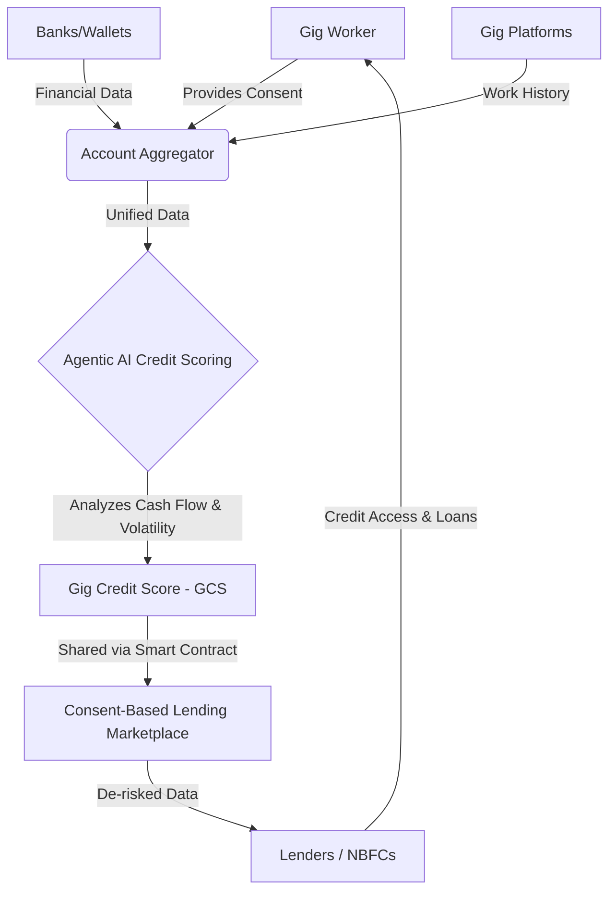
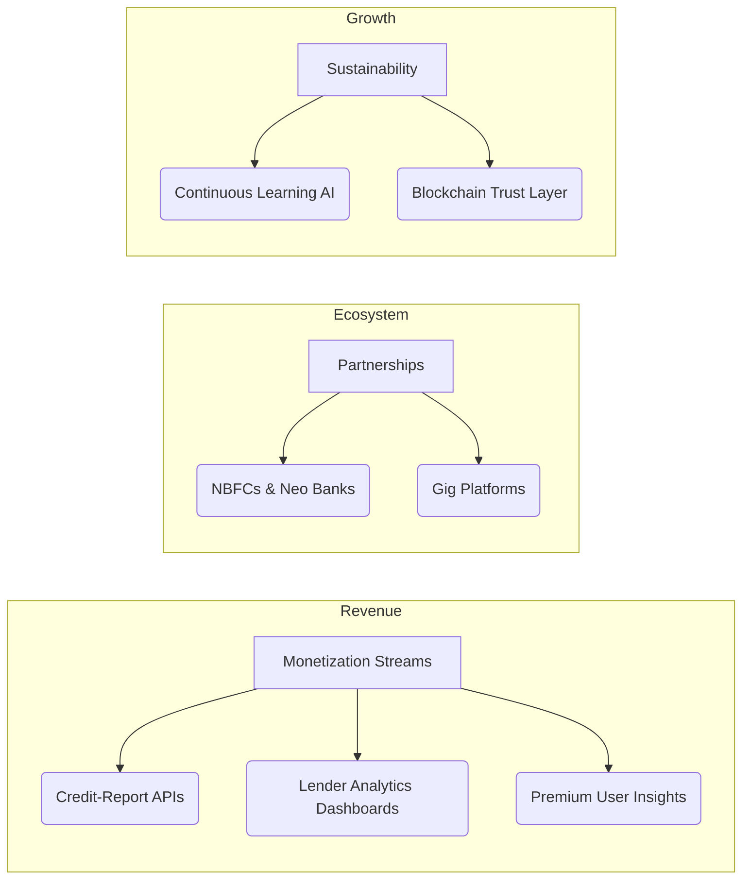

# CrediFlow: Credit for the Next Billion Users

**Building verifiable financial identity to unlock credit access for the invisible workforce.**

CrediFlow empowers gig workers with verified credit access through AI, promoting financial inclusion and sustainable economic growth.

## ⚠️ The Problem

India's formal credit system (CIBIL) is built for the 10% salaried workforce, rendering over 400 million informal workers (drivers, freelancers, vendors) financially invisible. They generate income, pay bills on time, and build businesses, yet traditional banks see them as high-risk because they lack formal credit histories. 

The legacy credit scoring system is broken for today's dynamic, digital economy, denying loans, credit cards, and limited insurance options to the world's fastest-growing workforce segment.

## 💡 Proposed Solution

We are building verifiable financial identity on the blockchain to unlock credit access for the invisible workforce.

- **Unified Data Aggregation:** Securely consolidates all user financial data from banks, wallets, and gig platforms using the Account Aggregator (AA) framework for a complete financial view.
- **Agentic AI Credit Scoring:** A proprietary AI proactively analyzes unified data (income volatility, cash flow) to generate a dynamic "Gig Credit Score (GCS)" for fair, non-salaried credit assessment.
- **Consent-Based Lending Marketplace:** Connects workers to lenders via user-controlled data sharing. Users share their verified GCS and profile with explicit consent on-chain, providing lenders with reliable data to de-risk loans.

## ✨ Core Features & Innovation

1. **Blockchain-Based Alternative Data:** Utilizes digital footprint, work history, and social reputation for transparent and fair credit assessment.
2. **Dynamic Agentic AI:** Analyzes real-time transaction behavior—not just past repayments—and acts as a financial co-pilot to offer personalized insights to users.
3. **Verifiable Financial Identity:** Develops an auditable financial identity using the Account Aggregator as a consent-based, single source of truth.
4. **On-Chain User Sovereignty:** Consent is managed via on-chain smart contracts. Revocation is instant and programmatic, ensuring absolute user control.

## 🛠 Tech Stack

- **Backend / Web Integration:** Django/Flask, LangChain for AI integration
- **Blockchain / Web3:** Web3.py, Solidity, Polygon, Hyperledger
- **Wallets & Integration:** Biconomy / Pimlico SDKs for Web2-style logins (phone/email), hiding Web3 complexity
- **Data Aggregation:** India's Account Aggregator (AA) network (Finvu, CAMS, OneMoney)

## 💼 Business Model & Viability

- **Monetization Streams:** Revenue through credit-report APIs, analytics dashboards for lenders, and premium user insights.
- **Partnerships:** Collaboration with NBFCs, neo-banks, and gig platforms to strengthen ecosystem reach.
- **Sustainability:** Continuous learning AI combined with a blockchain trust layer creates a defensible, future-proof product.

### Challenges & Mitigation
- **Regulatory Alignment:** The framework aligns with RBI's DEPA and AA guidelines, easing compliance barriers.
- **User Adoption:** SDKs allow for seamless Web2-like logins to minimize Web3 complexity for non-technical users.

## 👥 Meet the Team (Team N.A.O.L)

- **Sharvi**
- **Aayush Grover**
- **Sutanu Kumar Das**
- **Shruti**

---
*Built for empowerment, financial inclusion, and secure & transparent ecosystem.*